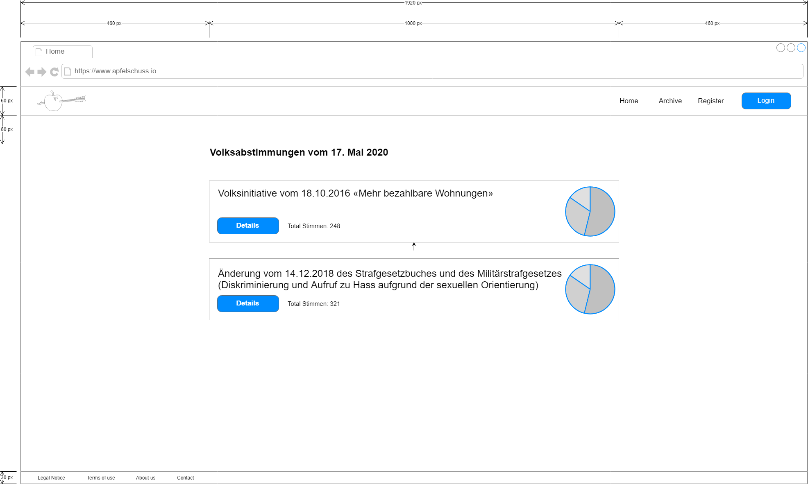

# Wireframes of apfelschuss.io

This repository includes wireframes (also known as page schematic or screen blueprint) of the [apfelschuss.io](https://apfelschuss.io/) web application frontend.

> Don't know what Apfelschuss is? Check out [apfelschuss main repo readme](https://github.com/Apfelschuss/apfelschuss/blob/master/README.rst) for more information about this project.

The source files of this project can be found in the [source](source) folder. All wireframes are created with [draw.io](https://www.draw.io/), which is a free online diagram software.

Export of source files (png, jpg, pdf, svg and so on) are stored in the [export](export) folder.

## Base template

The base template is a 1920 x 1080px browser window.

